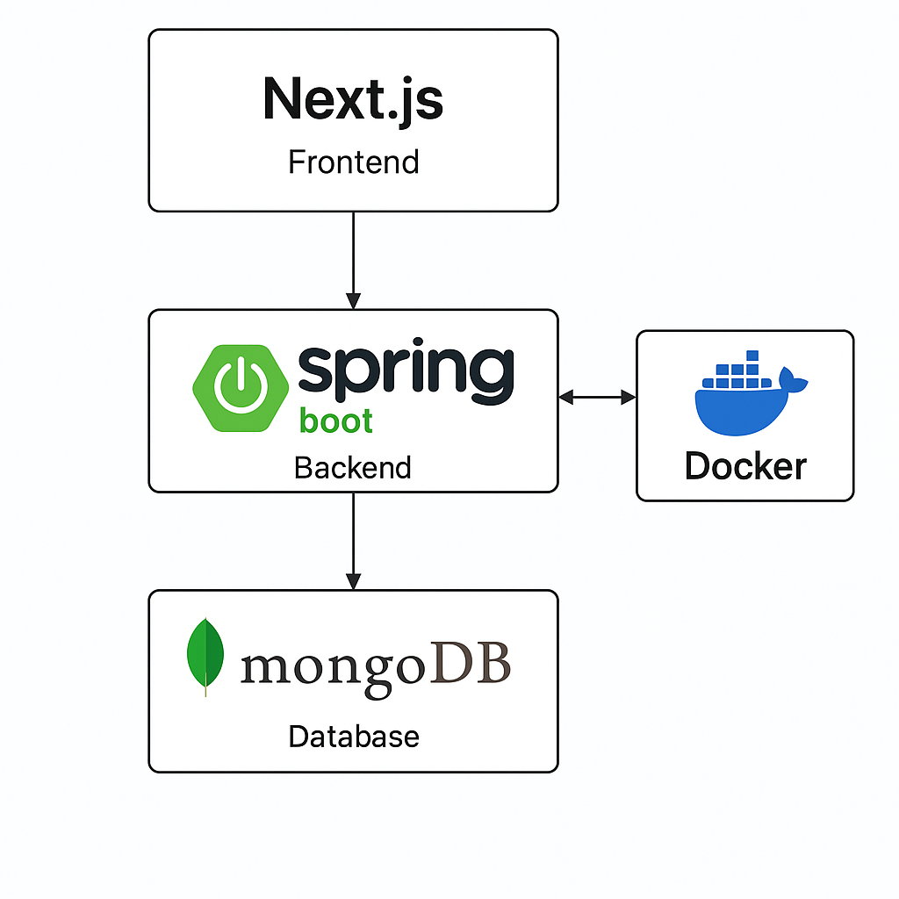
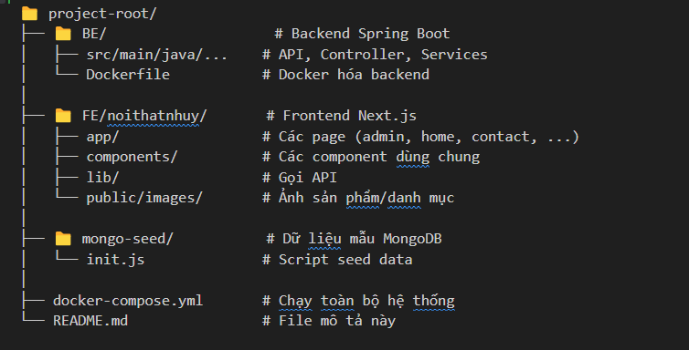

# 🛋️ Nội Thất Như Ý - Website Bán Hàng Nội Thất

Đây là website bán hàng nội thất do tôi tự thiết kế và phát triển full-stack với frontend bằng Next.js và backend bằng Spring Boot. Website hỗ trợ quản lý sản phẩm, danh mục, liên hệ từ khách hàng và có trang Admin riêng biệt.


## 🧰 Công Nghệ Sử Dụng

- **Frontend:** Next.js (React), TailwindCSS, Shadcn/ui
- **Backend:** Spring Boot, RESTful API
- **Database:** MongoDB
- **DevOps:** Docker & Docker Compose
- **Khác:** Multer (upload ảnh), Email Service (liên hệ)



---

## 🧩 Các Chức Năng Chính

### 👨‍💼 Trang Admin
- Thêm / sửa / xoá **sản phẩm**
- Thêm / sửa / xoá **danh mục**
- Quản lý **hình ảnh** sản phẩm
- Giao diện responsive, dễ sử dụng

### 🛒 Trang Khách Hàng
- Xem danh sách sản phẩm theo danh mục
- Giao diện hiện đại, responsive
- Form **liên hệ** gửi email về quản trị viên

---
## 🗂️ Cấu Trúc Dự Án



## ⚙️ Hướng Dẫn Chạy Local

### Yêu cầu
- Node.js v18+
- Java 17+
- Docker & Docker Compose
- MongoDB

### Run
```bash
git clone https://github.com/esplen74/interior.git
open bash terminal
run cmd: sh build-local

📩 Liên hệ
Tác giả: Phan Việt Huy

Email: phanviethuy670@gmail.com